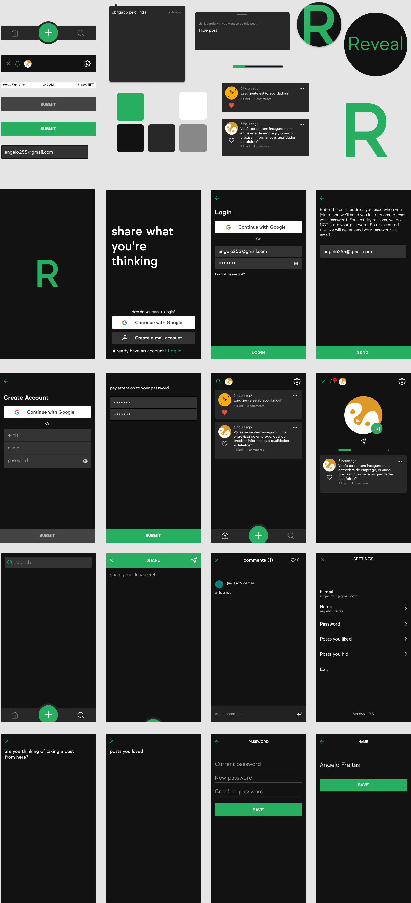

## Reveal

  

 
 
 

### About
Reveal is a type of social network where users are anonymous, they can share ideas, secrets and what they are thinking at that very moment.

###  Technologies used
- TypeScript
- Postgress
- Redis
- Express
- React Native
- MongoDB
- EJS
- Firebase

<ul>
  <li>others:</li>
  <ul>
    <li>cacheable</li>
    <li>authenticate + refresh token</li>
    <li>rate limiter</li>
    <li>multiple logins (local, social)</li>
    <li>deep linking</li>
    <li>scroll infinite</li>
    <li>ACL</li>
  </ul>
</ul>

<h4>📸 Prototype</h4>

  

## Versioning
This project does not have a versioning system.

## History
Take a look at the tab [Releases](https://github.com/t-heu/reveal/releases) to track changes made to the project.

## License
[MIT License](./LICENSE) © [Math](https://github.com/t-heu/)
