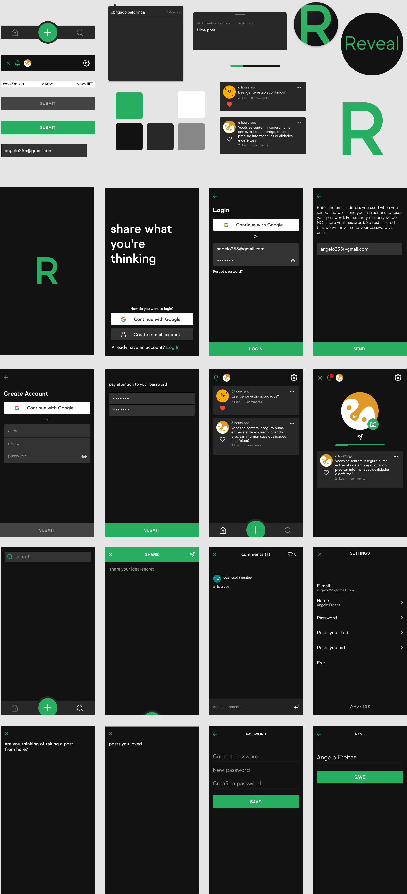

  

  

## 📷 Screenshot/Prototype

  

## 📄 About
Reveal is a type of social network where users are anonymous, they can share ideas, secrets and what they are thinking at that very moment.

## ⚡ Tech Stack

## ⛓️ Functionalities
<ul>
  <li>authenticate + refresh token</li>
  <li>multiple logins (local, social)</li>
  <li>deep linking</li>
  <li>scroll infinite</li>
</ul>

## 🐛 Problems and Support

If you encounter any problems, feel free to open an [issue](https://github.com/t-heu/mobile_reveal/issues).

## 📄 License
This project is licensed under the MIT License. See the [LICENSE](LICENSE) file for more details.
